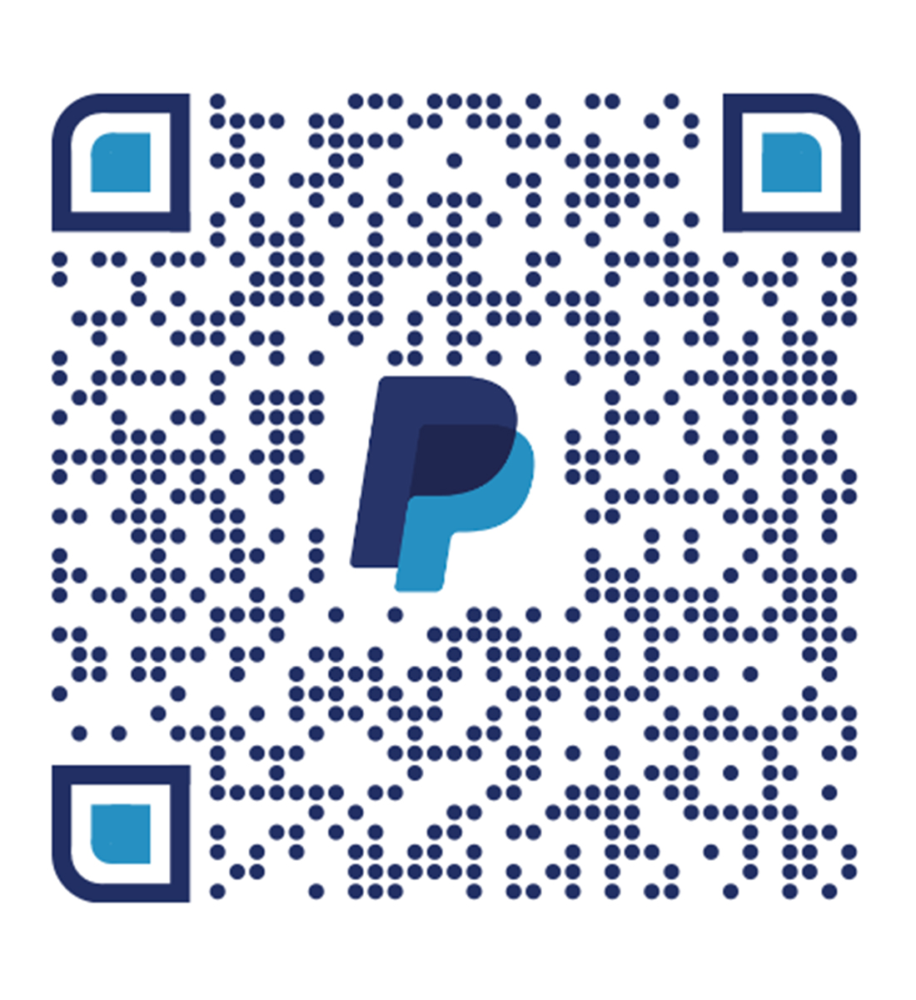
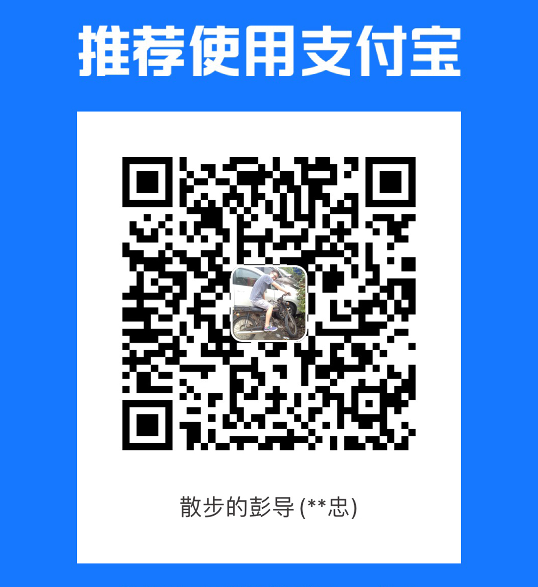

###  🌲Midjourney 相关内容分享
1. ChatGPT生成Midjourney关键词：[训练方案](https://pengdirect.notion.site/ChatGPT-Midjourney-56b94fb2a05441e286ac195e5714ba64)
2. Midjourney：[关键词总结](https://docs.google.com/spreadsheets/d/1GuAeSFtICsjQEwsRP2f--IayDxW9Dl0SCLOVov56FMc/edit?userstoinvite=smilevenuswww%40gmail.com#gid=1862105056)
3. Midjourney：[学习资料](https://pan.baidu.com/s/1rv1Nr6N2SFVR0PBoDcNb9g?pwd=cq8b)
4. Midjourney：[提示词生成器1](https://www.kandouyin.com/)

###  📋ChatGPT 相关内容分享
1. ChatGPT：[安装方法](https://www.v2ex.com/t/900126)
2. ChatGPT4 API申请：[排队链接](https://openai.com/waitlist/gpt-4-api)
3. AutoGTP 终极教程：[安装与使用](https://pengdirect.notion.site/AutoGTP-cbb9d8c7775343a091d5918bdbd79630)

###  💻我的软件
1. 发票终结者V3.2：[安装包地址](https://github.com/unAlpha/Invoice-Terminator/releases/tag/V3.2)

###  🌎讨论与交流
- TG群（主）：[链接](t.me/pengdirect)

- Q-群（副）：32782385

###  🦴打赏功能

| Paypal | Wechat Pay | Ali Pay |
| --- | --- | --- |
| |  |  |
